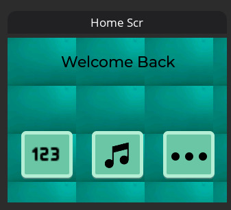
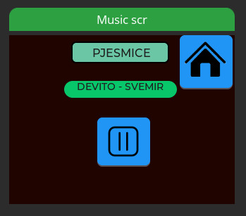
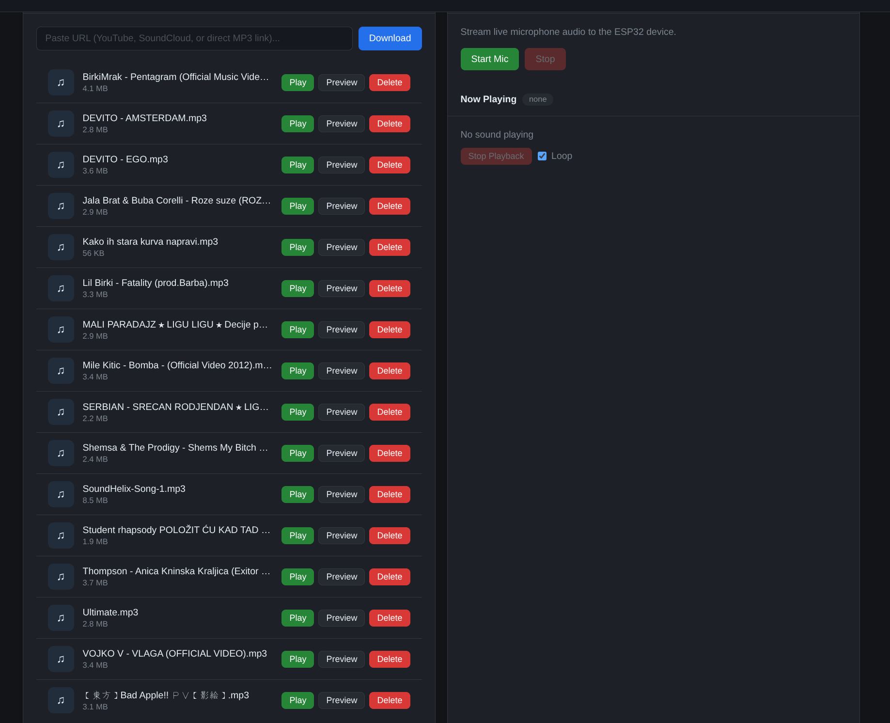
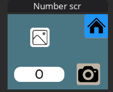
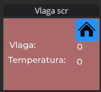

# WES System Usage Guide

This document provides a formal operational guide for the WES system.
It explains system components, application behavior, build steps, and runtime data flow.

## 1. System Components

- ESP32 Main Device (this repository): primary controller with touchscreen UI.
- ESP32-S3 Camera Node: sends JPEG frames on request.
- ESP32-S3 ML Node: performs local digit recognition inference.
- ESP32-S3 Anchor Node: provides beacon/AP signal for distance alarm logic.
- Web Interface (separate project): used for music and control features.

## 2. Main Capabilities

- Touch UI with four screens: Home, Music, Number, and Humidity.
- Image capture from camera node with on-screen preview.
- JPEG forwarding to ML node and display of predicted digit (0-9).
- Local audio playback over I2S from SPIFFS assets.
- In-app temperature and humidity display using the SHT31 sensor.
- Distance-based alarm trigger when the anchor node is beyond threshold.

## 3. UI Behavior

### Home Screen

- `123` button opens the Number screen.
- Music-note button opens the Music screen.
- Three-dot button opens the Humidity screen.

### Music Screen

- Center button (pause icon) starts local audio playback from `/spiffs/output.wav`.
- Home button returns to Home.

- Web interface for streaming music to our separate esp32s3

### Number Screen

- Camera button triggers capture.
- Top-left area shows the latest JPEG preview.
- Main label shows the recognized digit result.
- Home button returns to Home.

### Humidity Screen (Temperature and Humidity in App)

- Displays humidity and temperature values in real time.
- Values are read from the SHT31 service and rendered directly in the UI.
- Sensor integration path:
  - Sensor driver/service: `main/sht31_service.c`
  - UI presentation: Humidity screen in the application
- Home button returns to Home.

## 4. Digit Recognition Pipeline

- The model runs locally on the ESP32-S3 ML node (no cloud inference).
- Input: JPEG frame.
- Output format: `RESULT <digit> <confidence>`.
- Processing path is optimized for digit recognition:
  - resize to 28x28
  - adaptive thresholding
  - mask cleanup
  - inversion and centering
- Inference is executed with TensorFlow Lite Micro.

### End-to-End Number Flow

1. User presses the camera button on the Number screen.
2. Main device sends `SEND_PIC` to camera node over UART1.
3. Main device receives JPEG and updates preview.
4. Main device sends image to ML node over UART2:
   - `INFER_JPEG`
   - `<jpeg_size>`
   - `<jpeg_bytes>`
5. ML node returns `RESULT <digit> <confidence>`.
6. Number label in the UI is updated with prediction.

## 5. Locality Model and Its Role

Locality is a core design principle in this system. It means data processing and control remain on-device or within the local network, instead of depending on cloud services.

- Compute locality:
  - Digit inference is executed on the local ML node.
  - Distance alarm logic is evaluated on the main device.
  - Audio alarms are generated and played locally.
- Data locality:
  - Camera frames move only over local UART links.
  - Sensor values (SHT31) are read on the main device and shown directly in app UI.
  - No cloud upload is required for core features.
- Network locality:
  - Web node communication is local (WebSocket in local environment).

Benefits of this approach:

- Lower latency for camera-to-inference and UI updates.
- Better operational resilience if internet is unavailable.
- Improved privacy, because raw image/sensor data remains local.
- Predictable demo behavior in offline conditions.

## 6. Distance Alarm (Anchor Node)

- Main device periodically scans SSID `FTM_Anchor`.
- Distance is estimated from RSSI.
- If estimated distance exceeds configured limit (`6.0 m`), siren/beep is triggered.
- Beep uses a cooldown interval to avoid repeated triggers every cycle.
- Alarm audio is generated locally and played via I2S.

## 7. Web ESP32-S3 Node Interface (Separate Firmware)

- Connects to local WebSocket server.
- Accepts commands and returns JSON responses.
- Reports healthcheck state.
- Supports image and audio-related commands.

Command set:

- `healthcheck`
- `capture_image`
- `audio_start`
- `audio_data`
- `audio_stop`

## 8. Hardware Configuration (This Repository)

- Audio I2S pins in `main/app_main.c`:
  - BCLK: GPIO25
  - LRC/WS: GPIO33
  - DOUT: GPIO32
- Camera node UART in `main/camera_capture.c`:
  - TX: GPIO27
  - RX: GPIO26
- ML node UART in `main/app_main.c`:
  - TX: GPIO14
  - RX: GPIO2
- SHT31 I2C in `main/sht31_service.c`:
  - SDA: GPIO22
  - SCL: GPIO21

## 9. Pre-Build Checklist

1. Confirm `spiffs_data/output.wav` is present.
2. Connect UART lines to camera and ML nodes.
3. Connect I2S output to amplifier/speaker.
4. Connect SHT31 to I2C pins.

## 10. Build and Flash

### Main Device (this repository, ESP32 target)

- `idf.py set-target esp32`
- `idf.py build`
- `idf.py -p COMx flash monitor`

### ML Node and Anchor Node (separate repositories, ESP32-S3 target)

- `idf.py set-target esp32s3`
- `idf.py build`
- `idf.py -p COMx flash monitor`

## 11. Scope Note

- The web interface is separate from this repository.
- This repository contains the main device firmware and local orchestration logic.
